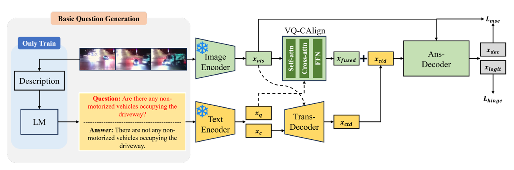

# FIQ: Fundamental Question Generation with the Integration of Question Embeddings for Video Question Answering
This is the official repository of the paper FIQ: Fundamental Question Generation with the Integration of Question Embeddings for Video Question Answering, which was published in IEEE International Conference on Systems, Man, and Cybernetics (SMC) 2025

[[paper]](https://arxiv.org/abs/2507.12816)


## Dataset Preparation
We use [SUTD-TrafficQA](https://sutdcv.github.io/SUTD-TrafficQA/#/) as a main dataset. Please download the dataset by following the link, and place it under /data folder. The directory structure would be like:

```
FIQ/
|-- data/
|-- model/
|-- ...
```

For the feature files, checkpoints, and Q&A dataset json file, please download it through the [google drive](https://drive.google.com/drive/folders/1u4bk0CUn17Y67lxlVML9EQst78mpTT6Q).

## Installation
We use the docker environment for this experiment. After the preparation of the dataset, please run the following command below:

```
docker run -itd \
  -v ./FIQ:/workspace/FIQ \
  -v ./raw_videos/:/workspace/FIQ/data/raw_videos \
  -v ./SUTD-TrafficQA-Dataset/annotations/archived/R3_all.jsonl:/workspace/FIQ/data/annotation_file/R3_all.jsonl \
  --gpus all \
  --name tem-adapter-remove\
  pytorch/pytorch:2.5.0-cuda12.4-cudnn9-devel
```
After running the command above, please run commands below inside a docker container.

```
pip install ffmpeg scikit-video ftfy regex tqdm timm jsonlines
apt-get update
pip install git
pip install git+https://github.com/openai/CLIP.git
pip install -r requirements.txt
```


## Preprocessing
```
CUDA_VISIBLE_DEVICES=6 python preprocess/preprocess_features.py --dataset sutd-traffic --model clip_image 
```

## Q&A Dataset Generation
We use [VideChat2](https://github.com/OpenGVLab/Ask-Anything/tree/main/video_chat2) to extract the video description. Based on this, we design the prompt to generate Q&A pairs for GPT-4o-mini by following [paper](chrome-extension://efaidnbmnnnibpcajpcglclefindmkaj/https://aclanthology.org/2022.naacl-main.142.pdf). Please run the command below to generate Q&A pairs:
```
```
For the detailed process of question generation, please follow the [link]().
## Training
To train the model, please run the following command:
```
CUDA_VISIBLE_DEVICES=6 python train.py --cfg configs/sutd-traffic_transition.yml
```

## Evaluation
To evaluate the model, please execute the following command structure:
```
CUDA_VISIBLE_DEVICES=6 python validate.py --cfg configs/sutd-traffic_transition.yml
```
## Citation  
if you find our work is helpful, please consider cite this paper (Coming soon):
```
```
## Acknowledgement
Our methods are developed based on [Tem-adapter](https://github.com/XLiu443/Tem-adapter). Thank authors for releasing the code and the pretrained models.
